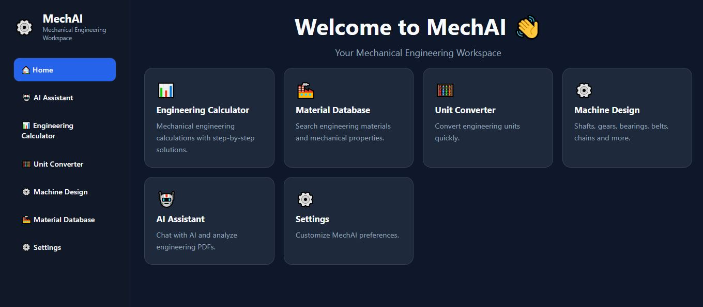

# MechAI

> **AI-Powered Engineering Assistant for Mechanical Engineering Students**

MechAI is a Flask-based web application that combines AI with essential mechanical engineering tools in one workspace. It is designed to help students solve engineering problems, perform calculations, explore material properties, analyze PDFs, and access machine design resources through an intuitive interface.

---

## 🚀 Live Demo

**Website:** https://mechai-exxh.onrender.com/

---

## 📸 Dashboard



---

## ✨ Features

- 🤖 AI Assistant for engineering-related queries
- 📊 Engineering Calculator
- 📚 Material Database
- 📏 Unit Converter
- ⚙️ Machine Design Resources
- 📄 AI-powered PDF Analysis
- ⚡ Clean and responsive user interface

---

## 🛠️ Tech Stack

| Technology | Purpose |
|------------|---------|
| Python | Backend |
| Flask | Web Framework |
| HTML5 | Frontend Structure |
| CSS3 | Styling |
| JavaScript | Interactivity |
| Google Gemini API | AI Assistant |
| Git & GitHub | Version Control |

---

## 📦 Installation

Clone the repository:

```bash
git clone https://github.com/ByBhoomika/MechAI.git
```

Move into the project directory:

```bash
cd MechAI
```

Install the required packages:

```bash
pip install -r requirements.txt
```

Run the application:

```bash
python app.py
```

Open your browser and visit:

```
http://127.0.0.1:5000
```

---

## 📂 Project Structure

```text
MechAI/
├── assets/
│   └── dashboard.JPG
├── mechai/
├── static/
├── templates/
├── app.py
├── config.py
├── requirements.txt
├── .gitignore
└── README.md
```

---

## 🎯 Future Improvements

- User authentication
- CAD utilities
- Additional engineering calculators
- More AI-powered engineering tools
- Mobile-friendly improvements

---

## 👩‍💻 Author

**Bhoomika Singh**

B.Tech Mechanical Engineering Student

Interested in Mechanical Engineering, Artificial Intelligence, CAD, Python, Web Development, and Engineering Software Development.

---

⭐ If you found this project useful, consider giving it a star.
